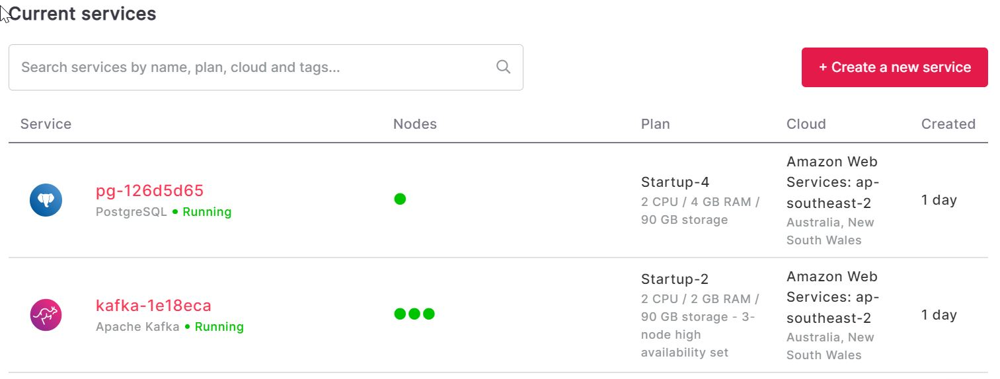
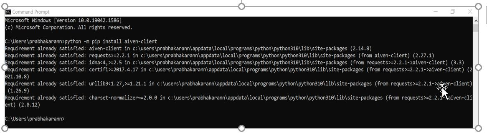
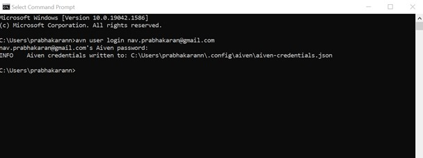
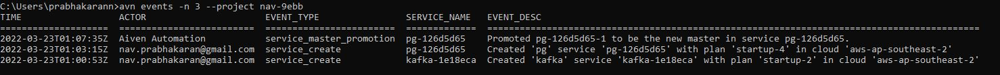

# Support Engineer Assignment 1
#### Name: Navin Prabhakaran
<br/>

**1** . Please sign up to Aiven and create a small Kafka and PostgreSQL service. 



**2** . Configure and install the Aiven CLI and use the CLI to see the last 3 events of the services you launched. 
```{r}
$ python -m pip install Aiven-client
```


**3** . Send us the output of the last 3 events you launched, including all the commands you executed in fetching the 3 events.
```{r}
$ avn user login nav.prabhakaran@gmail.com
```


**4** . Output of the last 3 events you launched, including all the commands you executed in fetching the 3 events. 
```{r}
# avn events -n 3 --project nav-9ebb
```


<br/>

# Support Engineer Assignment 2

**If you have any questions regarding the assignment instructions and the R Markdown template**, please post it on discussion board. 


## Required packages 


Provide the packages required to reproduce the report. Make sure you fulfilled the minimum requirement #10.

```{r}
# This is the R chunk for the required packages

```


## Executive Summary 


In your own words, provide a brief summary of the preprocessing. Explain the steps that you have taken to preprocess your data. Write this section last after you have performed all data preprocessing. (Word count Max: 300 words)


## Data 

A clear description of data sets, their sources, and variable descriptions should be provided. In this section, you must also provide the R codes with outputs (head of data sets) that you used to import/read/scrape the data set. You need to fulfil the minimum requirement #1 and merge at least two data sets to create the one you are going to work on. In addition to the R codes and outputs, you need to explain the steps that you have taken.


```{r}
# This is the R chunk for the Data Section

```

## Understand 

Summarise the types of variables and data structures, check the attributes in the data and apply proper data type conversions. In addition to the R codes and outputs, explain briefly the steps that you have taken. In this section, show that you have fulfilled minimum requirements 2-4.


```{r}
# This is the R chunk for the Understand Section

```


##	Tidy & Manipulate Data I 

Explain why your data (or one of the data sets) doesn’t conform the tidy data principles (minimum requirement #5). Apply the required steps to reshape the data into a tidy format. In addition to the R codes and outputs, explain everything that you do in this step.


```{r}
# This is the R chunk for the Tidy & Manipulate Data I 

```

##	Tidy & Manipulate Data II 

Create/mutate at least one variable from the existing variables (minimum requirement #6). In addition to the R codes and outputs, explain everything that you do in this step.


```{r}
# This is the R chunk for the Tidy & Manipulate Data II 

```


##	Scan I 

Scan the data for missing values, special values and obvious errors (i.e. inconsistencies). In this step, you should fulfil the minimum requirement #7. In addition to the R codes and outputs, explain your methodology (i.e. explain why you have chosen that methodology and the actions that you have taken to handle these values) and communicate your results clearly.


```{r}
# This is the R chunk for the Scan I

```


##	Scan II

Scan the numeric data for outliers. In this step, you should fulfil the minimum requirement #8. In addition to the R codes and outputs, explain your methodology (i.e. explain why you have chosen that methodology and the actions that you have taken to handle these values) and communicate your results clearly.

```{r}
# This is the R chunk for the Scan II

```


##	Transform 

Apply an appropriate transformation for at least one of the variables. In addition to the R codes and outputs, explain everything that you do in this step. In this step, you should fulfil the minimum requirement #9.


```{r}
# This is the R chunk for the Transform Section

```


NOTE: Note that sometimes the order of the tasks may be different than the order given here. For example, you may need to tidy the data sets first to be able to create the common key to merge. Therefore, for such cases you may have a different ordering of the sections.\  

Any further or optional pre-processing tasks can be added to the template using an additional section in the R Markdown file. Make sure your code is visible (within the margin of the page). Do not use View() to show your data, instead give headers (using head() )

<br>
<br>
