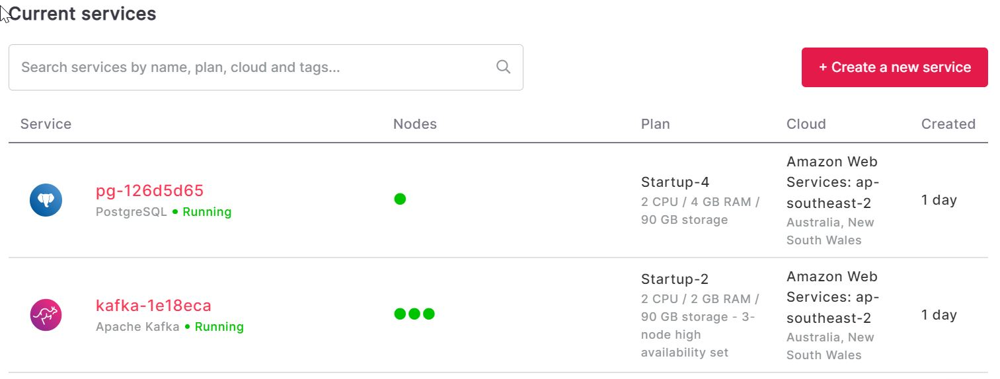
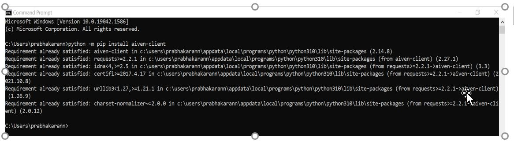
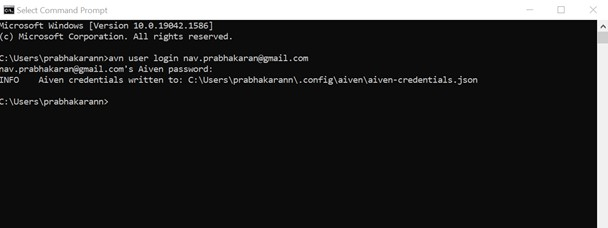
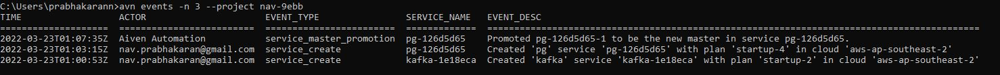

# Support Engineer Assignment 1
#### Name: Navin Prabhakaran
<br/>

**1** . Please sign up to Aiven and create a small Kafka and PostgreSQL service. 



**2** . Configure and install the Aiven CLI and use the CLI to see the last 3 events of the services you launched. 
```{r}
$ python -m pip install Aiven-client
```


**3** . Send us the output of the last 3 events you launched, including all the commands you executed in fetching the 3 events.
```{r}
$ avn user login nav.prabhakaran@gmail.com
```


**4** . Output of the last 3 events you launched, including all the commands you executed in fetching the 3 events. 
```{r}
# avn events -n 3 --project nav-9ebb
```


<br/>

# Support Engineer Assignment 2
